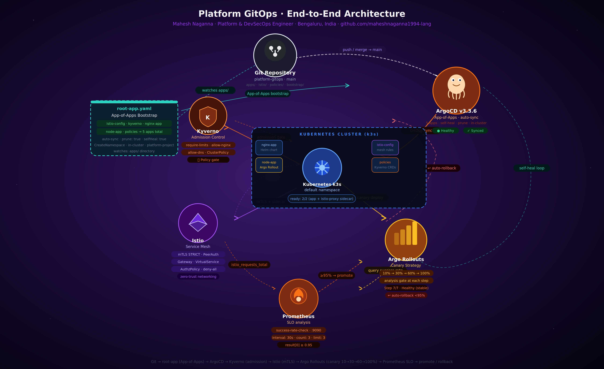

<div align="center">

# Platform GitOps

**Enterprise GitOps Delivery Platform for Kubernetes**

[](https://argo-cd.readthedocs.io/)
[](https://k3s.io/)
[](https://istio.io/)
[](https://argoproj.github.io/argo-rollouts/)
[](https://kyverno.io/)
[](https://prometheus.io/)

*Git as the single source of truth for secure, progressive, self-healing Kubernetes delivery*


</div>

---

## What this is

A production-grade GitOps platform built on Kubernetes that wires together continuous delivery, zero-trust networking, policy enforcement, and progressive deployment — all driven from a single Git repository.

Every component in the cluster is declared in Git. ArgoCD watches that repo and continuously reconciles the cluster state. When a canary rollout runs, Prometheus decides whether to promote or roll back automatically — no human intervention required.

---

## Platform flow



```
Git commit (main)
        │
        ▼
root-app.yaml ── App-of-Apps bootstrap
        │
        ▼
ArgoCD v3.3.6 ── reconciles 5 applications
        │
        ├──▶ istio-config   (path: istio/)
        ├──▶ kyverno        (Helm 3.0.0)
        ├──▶ nginx-app      (Helm chart)
        ├──▶ node-app       (Argo Rollout)
        └──▶ policies       (Kyverno + NetworkPolicy)
                │
                ▼
    Kubernetes cluster (k3s)
                │
        ┌───────┴────────┐
        │                │
        ▼                ▼
  Kyverno gate      Istio mesh
  (admission)       (mTLS STRICT)
        │                │
        └────────┬────────┘
                 │
                 ▼
        Argo Rollouts canary
        10% → 30% → 60% → 100%
           (Prometheus analysis at each step)
                 │
         ┌───────┴───────┐
         ▼               ▼
      promote         rollback
     (≥ 95%)         (< 95%)
```

---

## Architecture

### App-of-Apps pattern

The bootstrap entry point is a single ArgoCD `Application` (`bootstrap/root-app.yaml`) that watches the `apps/` directory. Every file in `apps/` is itself an ArgoCD Application. This means adding a new service to the platform is a single YAML file — ArgoCD discovers and deploys it automatically.

```
bootstrap/
└── root-app.yaml          ← deploy this once to seed everything
    └── watches: apps/
        ├── istio.yaml
        ├── kyverno/kyverno.yaml
        ├── nginx.yaml
        ├── node-app.yaml
        └── policies.yaml
```

### Kyverno — admission control gate

Every workload admitted to the cluster must pass three `ClusterPolicy` checks:

| Policy | What it enforces |
|--------|-----------------|
| `require-limits` | All containers must declare CPU and memory limits and requests |
| `allow-nginx` | Network egress rules for the nginx service account |
| `allow-dns` | Permits DNS egress from all workloads in the default namespace |

Kyverno is deployed via Helm (`chart: kyverno 3.0.0`) with `skipCrds: true` — CRDs are managed separately in `bootstrap/argocd-crds.yaml` to avoid race conditions.

### Istio — zero-trust service mesh

Three resources work together to form the security boundary:

**`PeerAuthentication`** — `mtls-strict.yaml` sets `mode: STRICT` across the entire `default` namespace. Every pod-to-pod connection must use mutual TLS. Plaintext is refused.

**`VirtualService` + `DestinationRule`** — `node-app-vs` routes incoming traffic between the `stable` and `canary` subsets. The weight split is updated programmatically by Argo Rollouts as the canary progresses. The `DestinationRule` maps pod labels (`version: stable`, `version: canary`) to the two subsets.

**`AuthorizationPolicy`** — `allow-nginx.yaml` and `allow-node-app.yaml` implement allow-list authorization. The default posture is deny-all; only explicitly permitted service-to-service paths are open.

### Argo Rollouts — canary delivery

The `node-app` Rollout progresses through four weight steps with Prometheus analysis gating each transition:

```
setWeight: 10
    └── analysis: success-rate-check
setWeight: 30
    └── analysis: success-rate-check
setWeight: 60
    └── analysis: success-rate-check
setWeight: 100  ← promote to stable
```

The `AnalysisTemplate` (`success-rate-check`) queries Prometheus every 30 seconds, three times per step. If the canary's HTTP success rate falls below **95%**, the rollout is aborted and all traffic is returned to the stable ReplicaSet immediately.

```promql
sum(rate(istio_requests_total{
  destination_service="node-app-canary.default.svc.cluster.local",
  response_code!~"5.*"
}[2m]))
/
sum(rate(istio_requests_total{
  destination_service="node-app-canary.default.svc.cluster.local"
}[2m])) > 0
```

---

## Repository structure

```
platform-gitops/
│
├── bootstrap/
│   ├── root-app.yaml          # App-of-Apps seed — deploy this first
│   └── argocd-crds.yaml       # CRD bootstrap (before Kyverno)
│
├── apps/                      # ArgoCD Application manifests
│   ├── istio.yaml
│   ├── nginx.yaml
│   ├── node-app.yaml
│   ├── policies.yaml
│   ├── kyverno/
│   │   └── kyverno.yaml       # Helm release (skipCrds: true)
│   └── node-app/
│       ├── rollout.yaml       # Argo Rollout + canary strategy
│       ├── service.yaml       # stable + canary Services
│       └── analysis-template.yaml  # Prometheus success-rate gate
│
├── istio/
│   ├── gateway.yaml
│   ├── virtualservice.yaml    # node-app traffic split
│   ├── destinationrule.yaml   # stable / canary subsets
│   ├── mtls-strict.yaml       # PeerAuthentication STRICT
│   ├── allow-nginx.yaml       # AuthorizationPolicy
│   └── allow-node-app.yaml
│
├── nginx-chart/               # Custom Helm chart
│   ├── Chart.yaml
│   ├── values.yaml
│   └── templates/
│       ├── deployment.yaml
│       ├── service.yaml
│       ├── httproute.yaml
│       └── _helpers.tpl
│
├── nginx/                     # Raw manifests (alternative to chart)
│   ├── deployment.yaml
│   └── service.yaml
│
├── policies/
│   ├── require-limits.yaml    # Kyverno: enforce resource limits
│   ├── allow-nginx.yaml       # Kyverno: nginx network policy
│   └── allow-dns.yaml         # Kyverno: DNS egress
│
├── projects/
│   └── project.yaml           # ArgoCD AppProject (RBAC boundary)
│
├── scripts/
│   └── recover.sh             # Recovery helper script
│
└── docs/
    ├── platform-gitops-flow.gif    # Animated platform flow
    ├── platform-gitops-flow.png    # Static platform flow
    ├── platform-gitops-infra.png   # Node-graph architecture diagram
    ├── architecture.md
    ├── canary-deployment.md
    └── troubleshooting.md
```

---

## Security controls

| Layer | Technology | What it does |
|-------|-----------|--------------|
| Admission | Kyverno ClusterPolicy | Blocks workloads missing resource limits |
| Network (L4) | Kubernetes NetworkPolicy | Namespace-level ingress/egress isolation |
| Encryption | Istio PeerAuthentication | mTLS STRICT — all pod communication encrypted |
| Authorization | Istio AuthorizationPolicy | Allow-list for service-to-service paths |
| GitOps | ArgoCD AppProject | Scopes which repos and namespaces each project can touch |

---

## Getting started

### Prerequisites

- Kubernetes cluster (k3s recommended)
- ArgoCD installed in the `argocd` namespace
- Istio installed with sidecar injection enabled on `default` namespace
- Argo Rollouts controller installed
- Prometheus available at `prometheus.istio-system.svc.cluster.local:9090`

### Bootstrap

```bash
# 1. Create the ArgoCD project boundary
kubectl apply -f projects/project.yaml

# 2. Apply CRDs before Kyverno (avoids admission webhook chicken-and-egg)
kubectl apply -f bootstrap/argocd-crds.yaml

# 3. Deploy the root App-of-Apps — ArgoCD takes it from here
kubectl apply -f bootstrap/root-app.yaml
```

ArgoCD will automatically discover and deploy all five applications. Within a few minutes everything should show `Healthy` + `Synced` in the ArgoCD UI.

### Verify canary

```bash
# Watch rollout progress
kubectl argo rollouts get rollout node-app --watch

# Check current step and traffic weights
kubectl argo rollouts status node-app

# View Istio traffic split
kubectl get virtualservice node-app-vs -o yaml
```

### Check policy enforcement

```bash
# Test that Kyverno blocks a pod without resource limits
kubectl run test --image=nginx
# → admission webhook should deny: "resource limits required"

# Confirm existing policies
kubectl get clusterpolicy
```

---

## Observability

Prometheus scrapes Istio's `istio_requests_total` metric via the sidecar proxy. The `AnalysisTemplate` uses this to compute the HTTP success rate for the canary subset and drives the rollout decision automatically.

Grafana dashboards can be pointed at the same Prometheus instance to visualise:
- Request rate per subset (stable vs canary)
- Error rate and latency percentiles
- Canary traffic weight over time

---

## Enterprise patterns demonstrated

- **GitOps** — Git as the only source of truth; no `kubectl apply` in production
- **App-of-Apps** — platform scales by adding YAML files, not running scripts
- **Progressive delivery** — canary with automated metric-based promotion/rollback
- **Zero-trust networking** — mTLS everywhere, deny-all with explicit allow-lists
- **Policy as code** — admission control enforced at the cluster boundary
- **Self-healing** — ArgoCD continuously reconciles; drift is corrected automatically

---

## Maintainer

**Mahesh Naganna** — Lead Platform & DevSecOps Engineer

[](https://github.com/maheshnaganna1994-lang)
[](https://linkedin.com/in/mahesh-naganna)

---

<div align="center">
<sub>This repo: GitOps delivery platform · ArgoCD · Istio · Kyverno · Argo Rollouts · Prometheus.<br>
Application source and CI pipeline lives in <a href="https://github.com/maheshnaganna1994-lang/atlas-aegis-backend">atlas-aegis-backend</a>.</sub>
</div>
